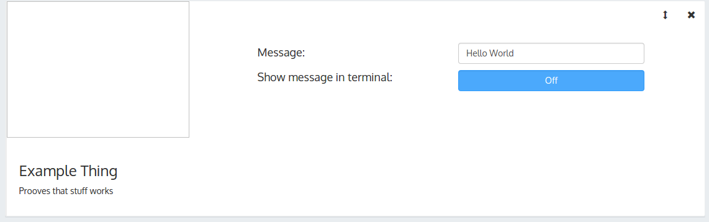
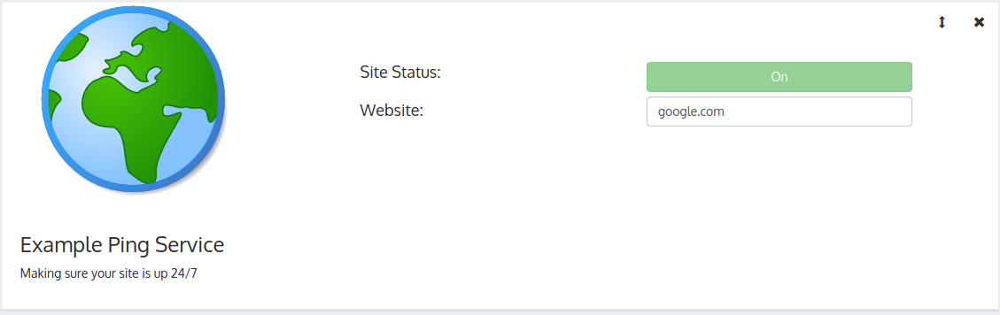

#Que IoT Examples
Example clients for [https://github.com/1egoman/que-iot](https://github.com/1egoman/que-iot)

**Thing vs Service**

A thing does an action in real life (ex: printing something to terminal or watering a plant)
while a service receives and processes data for things or api clients to possibly use.

**exampleThing**

This is a simple thing that echos what's typed into the box in Que's dashboard to the terminal when the user presses a button.

**exampleService**

This is a service that tells you if a website is currently up.

